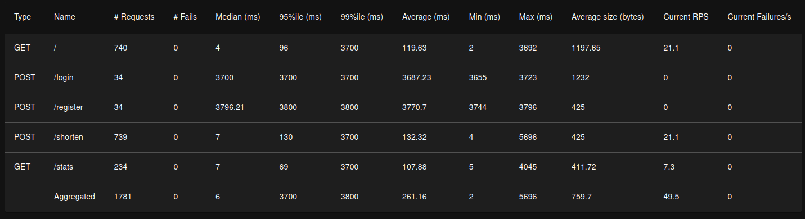

# URL shortener (high load hw1)
Команда:
- Ширяев Павел
## IDR
Базовый сокращатель URL, написанный на Python. Из особенностей архитектуры:
- Помимо сокращения ссылок, добавил возможность содания аккаунтов и просмотра статистики, чтобы при возможности было что разбивать на микросервисы, плюс безопасность как NFT.
- Использование Б/Д с Кафкой для того, чтобы отвечать требованиям высоконагруженности.
### Архитектурное решения
- Монолитная архитекутра. Писать проще, особенно учитывая размер команды. При потребности в масштабируемости, может потребоваться переписать на микросервисы
- PostgreSQL, т.к. хранить в памяти - не лучшая идея для масштабируемости. Перед альтернативным Б/Д - он достаточно быстрый, реляационнй, а главное - open source
- Kafka. Асинхрощина для потенциально большого количества запросов, чтобы хоть как-то справлялись с нагрузкой.
- Бекенд на Python, как самая простая опция. Фронтенд - чистый HTML, в связи с отсутсвием навыков дизайна.
- Docker, для упрощения деплоя + безопасности
### Безопасность
Используется JWT Flask-а, как работающее достаточно хорошо. Изобретать велосипед в безопасности может быть опасно.

Ключ лежит в .env, котоырй добавлен в gitignore, что позволяет хранить секрет. При деплое, нужно создать свой .env и положить туда секрет:
JWT_SECRET_TOKEN=your_secret_value

Если не делать, то это можнт быть потенциальной угрозой безопасности.

### Архитектура
Т.к. монолит, то ничего сложного:
User <-[API]----(Kafka для кликов, иначе ничего)---->[Backend]<====>[DB]
## Stress test / Нагрузочное тестирование
Проводился с помощью locust (./load_test), результаты - 
Достаточно долгое время только при логине и регистрации (~3 секунды). Это дольше обычного, но, в учловиях, что регистрация - единоразовое действие, а остальные endpoint-ы работают нормально (а ещё тот факт, что разворачивал на своём ноутбуке), то такое время считаю в пределах допустимого.
## Scrum meetings
Состав команды - 1 человек.
В SCRUM-митингах для одного человека смысла не увидел.
